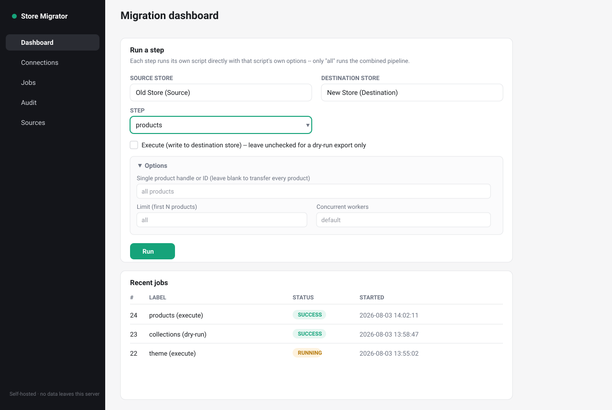
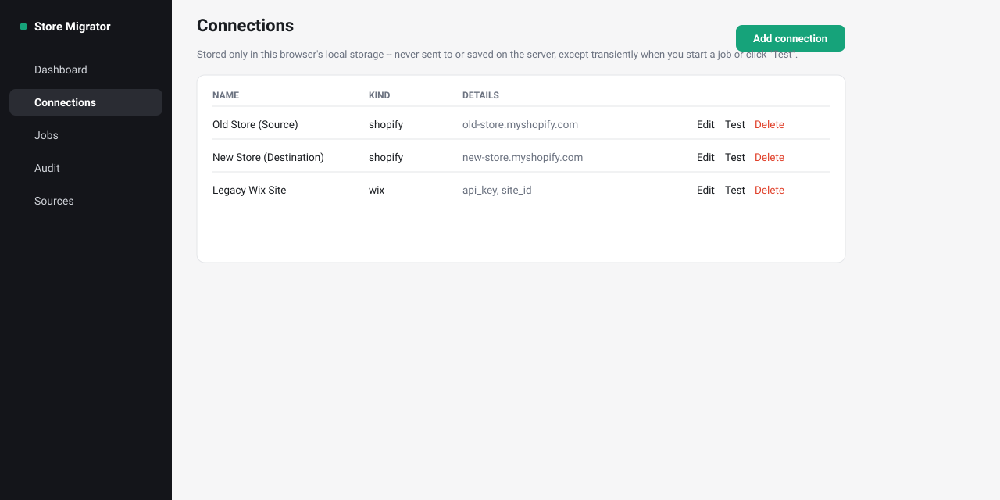
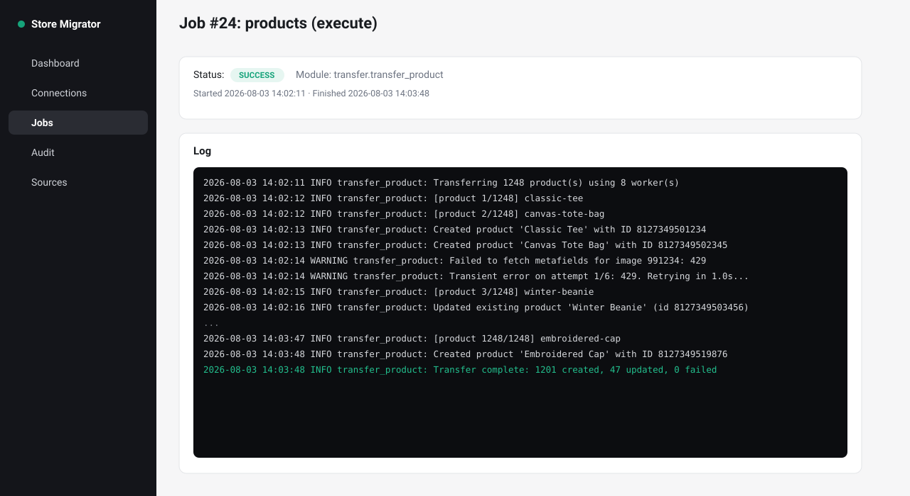
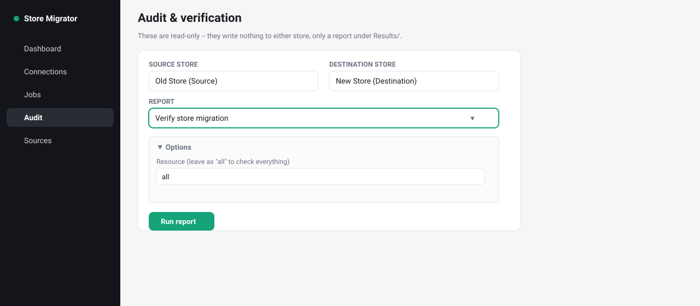
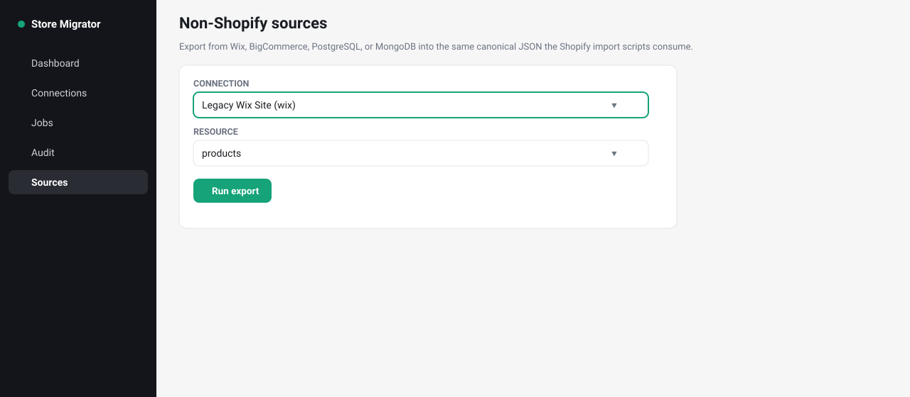

# Shopify Store Migrator

Migrate a store into Shopify — from another Shopify store, from Wix, from BigCommerce, or from a raw PostgreSQL/MongoDB database — using either a set of standalone CLI scripts or a self-hosted web app that wraps them.

No Shopify Partner account, no OAuth app review. Every store is connected with a custom-app access token, the same way you'd script it by hand.

> **Who this is for:** anyone moving a store onto Shopify (from Wix/BigCommerce/a database, or a custom platform via the CLI's canonical JSON format), anyone moving *between* two Shopify stores (agency rebuilds, store splits, staging→production promotion), and anyone who wants to script or extend a Shopify migration themselves.

---

## Visual tour

> The screenshots below are illustrative previews built from this repo's actual templates/styling (accurate colors and layout), not live browser captures — the fastest way to see the real thing is to run it yourself with the commands two sections down.

**Dashboard** — pick a source, a destination, and a step. Each step shows only *its own* real options (here, `products` with a handle filter, limit, and worker count):



**Connections** — stores and credentials, kept only in your browser:



**Job detail** — every run is a real OS process with a live-tailing log, killable mid-run:



**Audit** — read-only verification reports, diffing source against destination:



**Sources** — export from Wix/BigCommerce/PostgreSQL/MongoDB into the same canonical format:



---

## What it does

**Shopify → Shopify**, end to end: products (images, variants, metafields, inventory across every mapped location), collections, customers, orders, draft orders, blogs/articles, pages, navigation, redirects, policies, locations, metaobjects, store metafields, discounts (including Buy X Get Y), gift cards (opt-in), B2B companies/catalogs/price lists, markets, selling plans, customer segments, the theme, shipping profiles, and translations.

**Wix / BigCommerce / PostgreSQL / MongoDB → Shopify**: connectors that export products, collections, customers, orders (and more, per platform) into the same canonical JSON shape the Shopify-to-Shopify pipeline uses, so they feed straight into the same import scripts. PostgreSQL and MongoDB are config-driven — you supply a mapping YAML describing how your tables/collections map to the canonical fields (see `sources/postgresql/mapping.example.yaml` / `sources/mongodb/mapping.example.yaml`).

Every transfer script works two ways: as a **dry-run export** (default — writes canonical JSON, and optionally `.xlsx`, under `Results/`, changes nothing) or with **`--execute`** to actually write to the destination store. Any export (from Shopify or from another platform) can be replayed into the destination later with `--import-from <file>`, without needing a live connection to whatever produced it.

---

## Quick start

### The web app (recommended for most people)

```bash
docker compose up --build
```

Open `http://localhost:5000`.

Without Docker:

```bash
pip install -r requirements.txt
python run.py
```

### The CLI scripts directly

Copy `.env.example` to `.env`, fill in your store credentials, then:

```bash
python -m transfer.transfer_product --all              # dry-run: export every product to Results/
python -m transfer.transfer_product --all --execute     # actually create/update them on the destination
python -m transfer.transfer_all --execute                # run the whole pipeline in one go
```

Run any script with `--help` to see its full option set.

---

## Your first migration, step by step

This walkthrough uses the web app; the same steps map directly to CLI flags if you'd rather script it.

### 1. Get an access token from each store

On **both** the source and destination store:

1. Shopify admin → **Settings → Apps and sales channels → Develop apps** → **Create an app**.
2. **Configure Admin API scopes** — grant what the steps you plan to run need (see the scope list in [`.env.example`](.env.example); when in doubt, granting the full read/write set for the resources you care about is simplest).
3. **Install the app**, then reveal and copy the **Admin API access token** (starts with `shpat_`). You only see it once — save it somewhere safe.

You now have a shop name (`your-store.myshopify.com`) and an access token for each store.

### 2. Add both stores as Connections

Open **Connections → Add connection**, pick kind `shopify`, and enter the shop name + access token. Do this once for the source, once for the destination. Nothing here is sent to or stored on the server — it stays in your browser's `localStorage` and is only sent along with a request when you actually start a job or click **Test**.

Click **Test** on each to confirm the token works before running anything real.

### 3. Dry-run first

Go to **Dashboard**, pick your source/destination connections, choose a step (start with something low-risk like `pages` or `policies`), leave **Execute** unchecked, and hit **Run**. Watch the live log on the job page. This only *reads* from the source and writes a JSON/`.xlsx` export under `Results/` — nothing touches the destination yet.

Open the export and sanity-check it. This is the point to catch a wrong shop name or an overly narrow API scope, before anything is written.

### 4. Execute

Re-run the same step with **Execute** checked. Start with one resource at a time rather than jumping straight to `all` — it's easier to reason about logs and re-runs that way. Every script is idempotent: re-running an already-migrated resource updates or skips it rather than duplicating it, so it's safe to re-run a step that partially failed.

Work through the steps in roughly the order they're listed on the Dashboard — some depend on earlier ones (products and customers before orders/draft orders, for instance; `theme`/`translations` generally last, since translations map onto already-migrated resources).

### 5. Verify

Once you've migrated what you need, go to **Audit → Verify store migration** (and **Verify product migration** for a deep per-field product diff). These are read-only — they compare source and destination and report any mismatch, without writing anything. A few things (installed apps, payment provider configuration, staff accounts, tax registrations) aren't reachable through Shopify's API at all; the corresponding Audit reports give you a checklist for what still needs a manual look.

---

## Migrating *from* Wix, BigCommerce, PostgreSQL, or MongoDB

The **Sources** page (or `sources/*/main.py` on the CLI) exports from a non-Shopify platform into the same canonical JSON the Shopify importers expect:

```bash
python -m sources.wix.main --resource products
python -m transfer.transfer_product --import-from Results/wix_products_export_....json --execute
```

- **Wix / BigCommerce**: add a connection with that platform's API credentials (a Wix API key + site ID, or a BigCommerce store hash + access token), pick a resource, run.
- **PostgreSQL / MongoDB**: these have no fixed "product" schema, so you also point the connection at a mapping YAML file describing which table/collection and columns/fields correspond to each canonical field. Start from `sources/postgresql/mapping.example.yaml` or `sources/mongodb/mapping.example.yaml` and adjust it to your actual schema.

Once you have a canonical export file, feed it into the matching `transfer.transfer_X --import-from <file> --execute` exactly like a Shopify-sourced export — the importer can't tell the difference.

---

## Step reference

| Step | Covers | Notes |
|---|---|---|
| `products` | Title, body, images, variants, metafields, inventory per location | Largest/slowest step; supports `--limit`/`--start-at` to resume |
| `collections` | Custom + smart collections, images, metafields | |
| `customers` | Profile, addresses, marketing consent, metafields | |
| `customer_segments` | Saved customer search segments | |
| `orders` | Historical orders, line items, transactions (as already-paid) | Requires products + customers migrated first (SKU/email matching) |
| `draft_orders` | Open/invoice-sent draft orders | Same matching requirement as orders |
| `blogs`, `pages`, `navigation`, `redirects`, `policies` | Content and site structure | |
| `metaobjects`, `store_metafields` | Custom data definitions and values | Run before steps that reference them |
| `locations` | Store locations (not inventory itself) | Run before `products` if you want inventory split across locations |
| `discounts` | Percentage/fixed/free-shipping/BOGO codes and automatic discounts | App-owned discounts aren't portable |
| `gift_cards` | **Opt-in.** Creates *new* gift cards with the source's remaining balance | Requires an explicit confirmation checkbox — Shopify never exposes a portable redeemable code |
| `b2b` | Companies, locations, contacts, catalogs, price lists | |
| `markets` | Market definitions, regions, currency settings | |
| `selling_plans` | Subscription/selling plan groups | Doesn't move live subscriber contracts |
| `files` | Content > Files library | |
| `theme` | Theme code and assets | |
| `shipping` | Shipping profiles and rates | |
| `translations` | Translated content for already-migrated resources | Run last |
| `all` | Runs everything above in dependency order | The only step that uses `transfer.transfer_all` directly; every other step runs its own dedicated script |

## Verifying and troubleshooting

- **A step failed partway through** — safe to just re-run it; every importer dedupes by a natural key (handle, SKU, email, etc.) so already-migrated records are skipped or updated, not duplicated.
- **"Missing .env values" / a connection test fails** — double-check the shop name (with or without `.myshopify.com` both work) and that the access token's app has the scopes that step needs; see [`.env.example`](.env.example) for the full scope list.
- **Something looks wrong after migrating** — run the matching Audit report; it diffs source vs. destination field-by-field and tells you exactly what doesn't match, rather than requiring you to eyeball two admin panels.
- **Full option reference** — every script supports `--help`; the web app's per-step "Options" panel mirrors the same flags.

## Project layout

```
transfer/    one script per Shopify resource, plus transfer_all.py (the orchestrator)
audit/       read-only verification and checklist scripts
sources/     non-Shopify connectors: wix/, bigcommerce/, postgresql/, mongodb/
utils/       shared HTTP client, retry/backoff, error types, xlsx<->JSON, env helpers
app/         the self-hosted Flask web app (routes, templates, job runner)
docs/        canonical schema reference, web app usage guide, screenshots
```

For the web app's internals (how connections/jobs work, its single-process limitation, what's stored where) see [docs/APP_USAGE.md](docs/APP_USAGE.md). For the exact JSON shape every resource is exported/imported as — the contract that lets any source connector feed any Shopify import script — see [docs/CANONICAL_SCHEMA.md](docs/CANONICAL_SCHEMA.md).

## Requirements

Python 3.10+. `pip install -r requirements.txt` covers everything, including the optional per-connector dependencies (`psycopg2-binary` for PostgreSQL, `pymongo` for MongoDB, `openpyxl`/`xlsxwriter` for `.xlsx` support) — each is only imported lazily by the script that needs it, with a clear error telling you what to install if it's missing.
"# Shopify-Store-Migrator" 
